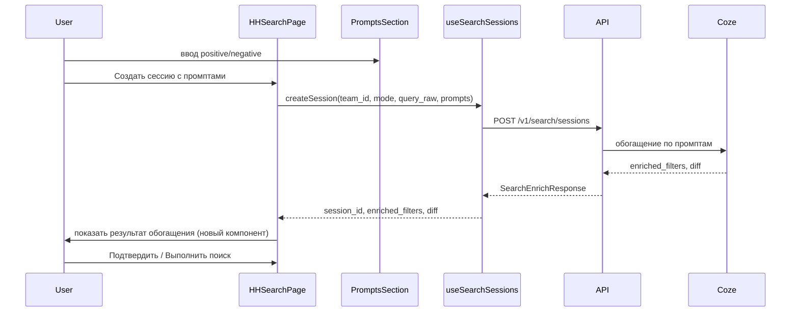

# API промптов для Cozy AI и план компонентов

## 1. Возможности API для промптов Cozy AI (Coze)

Промпты отправляются в бэкенд в формате **PromptsDTO** и обрабатываются через Coze для извлечения структурированных фильтров HH.

### Схема промптов (PromptsDTO)

| Поле       | Тип    | Описание |
| ---------- | ------ | -------- |
| `positive` | string | null     |
| `negative` | string | null     |

Пример из OpenAPI: пользователь пишет «Python разработчик с опытом 3+ года, возраст 25–50, зарплата 50–70 тысяч» — Coze извлекает `text_search.query`, `experience`, `age`, `salary`.

### Два сценария использования промптов

**Сценарий A: создание сессии с промптами (сразу обогащение)**

- **Метод:** `POST /v1/search/sessions`
- **Тело:** [SearchCreateRequest](src/api/openapi.json): `team_id` (обязательно), `mode` (обязательно: `resumes`  `vacancies`), `query_raw` (обязательно), `prompts` (опционально).
- **Поведение:** если переданы `prompts`, бэкенд сразу отправляет их в Coze и возвращает **SearchEnrichResponse** (а не просто сессию): `session_id`, `enriched_filters` (EnrichedDataDTO), `diff` (DiffDTO).

**Сценарий B: обогащение уже созданной сессии**

- **Метод:** `POST /v1/search/sessions/{session_id}/enrich`
- **Тело:** [SearchEnrichRequest](src/api/openapi.json): `prompts` (обязательно), `filters` (опционально — текущие фильтры для дополнения).
- **Ответ:** **SearchEnrichResponse** — те же `session_id`, `enriched_filters`, `diff`.

### Ответ обогащения (SearchEnrichResponse)

- **enriched_filters** ([EnrichedDataDTO](src/api/openapi.json)): что Coze извлекла из промптов:
  - `keywords_include` / `keywords_exclude` — ключевые слова
  - `text_search` — структурированный текстовый поиск (query, logic, field, period)
  - `skills`, `experience`, `age`, `location`, `schedule`, `employment`, `salary`
- **diff** ([DiffDTO](src/api/openapi.json)): списки полей `added`, `changed` и массив `warnings` — для отображения пользователю, что изменилось и какие предупреждения есть.

### Дальнейший сценарий после обогащения

- **Подтверждение:** `POST /v1/search/sessions/{session_id}/approve` (опционально переопределить `hh_request`).
- **Выполнение поиска:** `POST /v1/search/sessions/{session_id}/execute` (сессия должна быть в статусе `approved` или `executed`).

---

## 2. Текущее состояние UI и маппинг на API

- В [HHSearch.vue](src/pages/HHSearch.vue) форма хранит `positivePrompt` и `negativePrompt`; при отправке их нужно маппить в `prompts: { positive, negative }`.
- [HHSearchPromptsSection.vue](src/components/hh/HHSearchPromptsSection.vue) — два текстовых поля (положительный/отрицательный промпт); стили и разметка локальные, без использования общего [TextAreaField.vue](src/components/ui/fields/text/TextAreaField.vue).
- В проекте **нет** composable для поисковых сессий и **нет** вызовов `POST /v1/search/sessions` и `POST .../enrich`; [api.ts](src/api/api.ts) — только axios-инстанс.
- В [src/types/index.ts](src/types/index.ts) есть справочники (SessionStatusResponse, SearchModeResponse), но нет типов PromptsDTO, SearchCreateRequest, SearchEnrichRequest, SearchEnrichResponse, EnrichedDataDTO, DiffDTO, SearchSessionResponse и т.д.

---

## 3. Компоненты: что использовать, что создать

### Использовать существующее

- **Поля ввода текста:** [TextAreaField.vue](src/components/ui/fields/text/TextAreaField.vue) из `src/components/ui/fields/` — для полей промптов (positive/negative) в секции промптов, с подключением [fields.css](src/components/ui/fields/fields.css) для единообразия.
- **Команды:** [useTeams](src/composables/useTeams.ts) уже даёт список команд и выбор команды — нужны для `team_id` при создании сессии.
- **Справочники:** при необходимости — [useStatics](src/composables/useStatics.ts) (по аналогии добавить методы для `/v1/static/search-modes`, `/v1/static/session-statuses` если нужны в UI).

### Доработать существующие

- **HHSearchPromptsSection.vue**
  - Перейти на использование `TextAreaField` (label, placeholder, rows, при необходимости hint).
  - Оставить привязку к полям формы `positivePrompt` / `negativePrompt`; маппинг в `prompts.positive` / `prompts.negative` выполнять при отправке (в composable или на странице).
  - Секцию оставить переиспользуемой: только ввод промптов, без логики API.

### Создать новое

1. **Типы (src/types/index.ts)**
  Добавить интерфейсы по OpenAPI: `PromptsDTO`, `SearchCreateRequest`, `SearchEnrichRequest`, `SearchEnrichResponse`, `EnrichedDataDTO`, `DiffDTO`, `TextSearchDTO`, `ExperienceDTO`, `AgeDTO`, `LocationDTO`, `SalaryDTO`, `SearchSessionResponse`, `SearchSessionListResponse`, `SearchStatus`, `SearchMode` и при необходимости остальные (SearchApproveRequest, SearchExecuteRequest, SearchExecuteResponse, SearchResultResponse и т.д.).
2. **Composable useSearchSessions (например src/composables/useSearchSessions.ts)**
  Инкапсулировать работу с API поисковых сессий:
  - `createSession(payload: SearchCreateRequest)` → при передаче `prompts` обрабатывать ответ как SearchEnrichResponse;
  - `enrichSession(sessionId: string, payload: SearchEnrichRequest)` → SearchEnrichResponse;
  - при необходимости: `getSession`, `getUserSessions`, `getTeamSessions`, `approveSession`, `executeSession`, `deleteSession`.
   Типы запросов/ответов — из новых типов.
3. **Компонент отображения результата обогащения (рекомендуется)**
  Новый компонент, например в `src/components/hh/`: показывать после enrich:
  - **enriched_filters**: компактный вывод полей (keywords_include/exclude, text_search.query, skills, experience, age, location, schedule, employment, salary) в виде читаемого списка/блоков.
  - **diff**: добавленные и изменённые поля, плюс блок `warnings`.
   Это можно сделать одним компонентом, принимающим `enriched_filters` и `diff` (и опционально `session_id`), без дублирования стилей — использовать общие классы (например `.form-section` или классы из `fields.css` для подписей).
4. **Интеграция на странице HHSearch.vue (или отдельной странице «Новая сессия»)**
  - Выбор команды (useTeams), режима (resumes/vacancies), при необходимости — начальный `query_raw` (из текущей формы или дефолт).
  - Блок промптов (HHSearchPromptsSection) → сбор `prompts: { positive: form.positivePrompt || null, negative: form.negativePrompt || null }`.
  - Действия: «Создать сессию (с обогащением)» и/или «Обогатить» для уже созданной сессии — вызовы из useSearchSessions.
  - После ответа с SearchEnrichResponse — показать новый компонент с enriched_filters и diff; затем кнопки «Подтвердить» / «Выполнить поиск» (approve → execute) при необходимости.

---

## 4. Краткая схема потока данных

---

## 5. Чеклист по правилам проекта

- Стили: общие — в `fields.css` или `style.css`; в новом компоненте результата обогащения не дублировать уже существующие классы.
- Переиспользовать существующие компоненты: TextAreaField для промптов, useTeams для команды.
- Новый компонент только для того, чего нет — отображение enriched_filters и diff (и при желании — кнопки approve/execute в нём или на странице).
- Целостность: типы из OpenAPI в `types/index.ts`, один composable для сессий, остальная логика на странице или в одном месте.

---

## 6. Итог по возможностям API для промптов

- **Ввод:** два текстовых поля — положительный и отрицательный промпт (PromptsDTO).
- **Куда отправлять:** при создании сессии (опционально) или отдельным запросом обогащения по session_id.
- **Что получать:** session_id, enriched_filters (структурированные фильтры HH), diff (added/changed/warnings) для отображения пользователю и последующих шагов approve → execute.

Дальнейшая реализация: типы → useSearchSessions → рефакторинг HHSearchPromptsSection на TextAreaField → компонент результата обогащения → интеграция в страницу поиска (или страницу новой сессии).