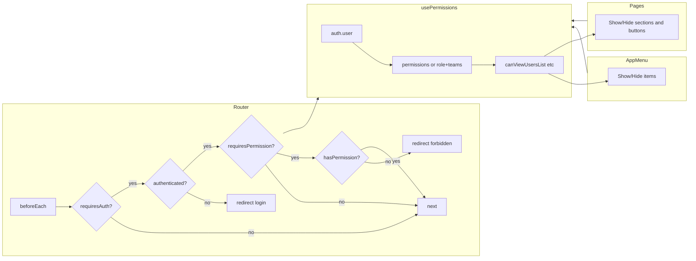

# Исследование: соответствие логике прав пользователей и команд

## Текущее состояние (выводы исследования)

### Что есть в проекте

- **Типы и API** ([src/types/index.ts](src/types/index.ts), OpenAPI): модель прав уже задана:
  - `UserResponse`: `role: RoleInfo`, `teams: TeamInfo[]` с полем `is_manager?: boolean`.
  - `PermissionType`: `view_users_list`, `view_teams_list`, `view_team_details`, `add_users`, `edit_users`, `delete_users`, `execute_hh_search`, `manage_team_permissions`, `manage_team_quotas`.
- **Бэкенд** (по OpenAPI): разграничивает доступ (403), в т.ч.:
  - Только **superadmin**: роли (CRUD + права роли), права команды (get/add/delete), лимиты квот (get/set/delete), HH OAuth (url, refresh, disconnect).
  - По **правам** (роль + команда): список/детали пользователей, список/детали команд, выполнение поиска и т.д.
- **Роутер** ([src/router.js](src/router.js)): проверяется только `requiresAuth`. Нет проверок по роли или правам — любой авторизованный пользователь может зайти на `/users`, `/teams`, `/teams/:id`, `/roles`, `/hh-search`, `/account`.
- **Меню** ([src/components/layout/AppMenu.vue](src/components/layout/AppMenu.vue)): пункты Users, Команды, Роли, HH Search показываются всем при `isAuthenticated`. Нет фильтрации по правам.
- **Страницы**: ни одна страница не ограничивает доступ и не скрывает блоки по правам:
  - [Users.vue](src/pages/Users.vue) — нет проверки `view_users_list` / `add_users` / `edit_users` / `delete_users`.
  - [Teams.vue](src/pages/Teams.vue), [TeamDetail.vue](src/pages/TeamDetail.vue) — нет проверки `view_teams_list` / `view_team_details`; кнопки создания/редактирования/удаления команд и блоки «Права команды»/«Лимиты квот» видны всем (при отказе API показывается только сообщение об ошибке в Teams.vue).
  - [Roles.vue](src/pages/Roles.vue) — доступ и все действия видны всем; по API роли — только superadmin.
  - [HHSearch.vue](src/pages/HHSearch.vue) — список команд из `useTeams().fetchTeams()` (бэкенд может фильтровать по правам), но страница и выбор команды не привязаны к праву `execute_hh_search` или к списку команд пользователя.
- **Нет composable** для проверки прав: не используется ни `auth.user.role.name`, ни `auth.user.teams[].is_manager`, ни список эффективных прав (его нет в `UserResponse` в текущем OpenAPI).

Итог: фронтенд не отражает модель «superadmin — все права; менеджер команды — управление своей командой; участник — только свои права». Доступ к страницам и действиям не ограничен; разграничение есть только на бэкенде (403).

---

## Целевая логика (кратко)

| Роль / контекст                                     | Ожидаемое поведение                                                                                                                                                                                |
| --------------------------------------------------- | -------------------------------------------------------------------------------------------------------------------------------------------------------------------------------------------------- |
| **Superadmin**                                      | Полный доступ: пользователи, команды, роли, права ролей/команд, лимиты квот, HH Search, HH OAuth и т.д.                                                                                            |
| **Менеджер команды** (`is_manager` в своей команде) | Видит и редактирует свои команды (в рамках прав команды); управление правами/квотами команды — только если бэкенд это разрешает (по текущему API — права/квоты команды только superadmin).         |
| **Участник команды**                                | Видит только то, что разрешено правами роли и команды (например, список команд при `view_teams_list`, детали при `view_team_details`, HH Search при `execute_hh_search` только по своим командам). |

Важно: в текущем OpenAPI в ответе `/v1/auth/me` нет поля с эффективными правами пользователя (только `role` и `teams` с `is_manager`). Поэтому на фронте можно либо (1) ввести эндпоинт вида `GET /v1/auth/me` с массивом `permissions` и опереться на него, либо (2) считать superadmin по имени роли (например `role.name === 'SUPERADMIN'`) и для остального — скрывать/показывать разделы по роли и `is_manager`, с учётом того, что финальная проверка на бэкенде уже есть.

---

## Предлагаемый план изменений

### 1. Источник прав на фронтенде

- **Вариант A (предпочтительно при возможности изменить API):** Добавить в ответ `GET /v1/auth/me` поле `permissions: PermissionType[]` (эффективные права пользователя: от роли + команд). Фронт тогда строит логику только по этому полю.
- **Вариант B (без изменения API):** Использовать `auth.user.role.name` и `auth.user.teams` (в т.ч. `is_manager`). Ввести константы ролей (например `ROLE_SUPERADMIN = 'SUPERADMIN'`) и считать, что superadmin имеет все права; для остальных — правила вида: доступ к странице «Роли» и к разделам «Права команды»/«Лимиты квот» только для superadmin; список команд и детали команды — по доступу к маршруту (бэкенд уже отфильтрует данные при 403).

### 2. Composable `usePermissions` (или `useAuth` с проверками прав)

- Расположение: например [src/composables/usePermissions.ts](src/composables/usePermissions.ts) (или расширить [src/composables/useAuth.ts](src/composables/useAuth.ts) если он есть и используется для auth).
- Входные данные: `useAuthStore().user` (и при варианте A — `user.permissions`).
- Экспорт функций/вычисляемых свойств, например:
  - `isSuperadmin` — по имени роли (или по наличию полного набора прав).
  - `canViewUsersList`, `canAddUsers`, `canEditUsers`, `canDeleteUsers` — по правам или по роли.
  - `canViewTeamsList`, `canViewTeamDetails`, `canCreateTeam`, `canEditTeam`, `canDeleteTeam`, `canManageTeamPermissions`, `canManageTeamQuotas` — по правам и при необходимости по `is_manager` для конкретной команды.
  - `canAccessRoles` — только superadmin (по текущему API).
  - `canExecuteHHSearch` — право `execute_hh_search` (и при необходимости ограничение по командам пользователя).
- Для команд: при необходимости передавать `teamId` и проверять `user.teams` с `is_manager` для действий «менеджера команды».

### 3. Роутер

- В [src/router.js](src/router.js) в `beforeEach` после проверки `requiresAuth`:
  - Загружать `auth.user` если ещё не загружен (уже есть `checkAuth`).
  - Для маршрутов с `meta.requiresPermission` (или `meta.requiresRole`) вызывать composable и при отсутствии права перенаправлять на главную или на страницу «Доступ запрещён», либо показывать 403-страницу.
- Задать `meta` для маршрутов, например:
  - `/users` — `requiresPermission: 'view_users_list'` (или аналог из composable).
  - `/teams` — `requiresPermission: 'view_teams_list'`.
  - `/teams/:teamId` — `requiresPermission: 'view_team_details'` (проверка по `params.teamId` может быть в guard или на странице).
  - `/roles` — только superadmin (или право на управление ролями, если появится в API).
  - `/hh-search` — `requiresPermission: 'execute_hh_search'` (или доступ только если есть хотя бы одна команда с таким правом).

### 4. Меню

- В [src/components/layout/AppMenu.vue](src/components/layout/AppMenu.vue) использовать composable прав:
  - Показывать «Users» только при `canViewUsersList` (или аналог).
  - «Команды» — при `canViewTeamsList`.
  - «Роли» — при `canAccessRoles` (superadmin).
  - «HH Search» — при `canExecuteHHSearch`.
- Account оставить всем авторизованным.

### 5. Страницы: скрытие блоков и кнопок

- **Users.vue**: кнопки «Создать»/«Редактировать»/«Удалить» и форма редактирования — показывать только при `canAddUsers` / `canEditUsers` / `canDeleteUsers`; при отсутствии `view_users_list` страницу лучше не показывать (редirect в роутере).
- **Teams.vue**: кнопки создания/редактирования/удаления команды и кнопка «Права» — показывать только при соответствующих правах; раздел прав команды в модалке — только superadmin (или при `canManageTeamPermissions`).
- **TeamDetail.vue**:
  - Секции «Права команды» и «Лимиты квот команды» — только для superadmin (или при `canManageTeamPermissions` / `canManageTeamQuotas`); иначе не рендерить блоки.
  - Редактирование названия/описания команды — по праву редактирования команды (и при необходимости по `is_manager` для этой команды).
- **Roles.vue**: доступ к странице уже ограничить в роутере (superadmin); на странице при необходимости скрыть кнопки создания/редактирования/удаления и модалки прав для неподходящих ролей (на текущем API это избыточно, т.к. вся страница только для superadmin).
- **HHSearch.vue**: выбор команды ограничить списком команд, к которым у пользователя есть право `execute_hh_search` (если бэкенд отдаёт только такие команды в `/v1/team`, дополнительная фильтрация по `auth.user.teams` может не понадобиться); при отсутствии права страницу не показывать (redirect из роутера).

### 6. Согласование с бэкендом

- Уточнить у бэкенда:
  - Возвращает ли `GET /v1/auth/me` эффективные права (`permissions: PermissionType[]`). Если да — использовать их в composable и в `meta.requiresPermission`.
  - Точные имена ролей (например `SUPERADMIN`, `ADMIN`, `USER`) и правила выдачи прав для менеджера команды (какие операции по команде разрешены при `is_manager` без superadmin).
- После этого зафиксировать в типах (при необходимости расширить `UserResponse`) и в одном месте (composable) маппинг роль/команда → права на UI.

### 7. Единая страница «Доступ запрещён»

- Добавить маршрут, например `/forbidden`, и при отсутствии права в `beforeEach` делать `next({ name: 'Forbidden' })` вместо перехода на главную, чтобы пользователь видел явное сообщение.

---

## Диаграмма потока доступа (целевая)

---

## Чеклист соответствия

- Ввести единый источник прав (composable) на основе `auth.user` и при возможности `user.permissions`.
- Роутер: проверка прав для маршрутов с `meta.requiresPermission` / superadmin.
- Меню: показ пунктов только при наличии соответствующих прав.
- Users: скрытие создания/редактирования/удаления по правам.
- Teams / TeamDetail: скрытие создания/редактирования/удаления команд, блоков «Права команды» и «Лимиты квот» для не‑superadmin (или по правам после уточнения API).
- Roles: доступ только для superadmin.
- HHSearch: доступ при наличии права на выполнение поиска; при необходимости фильтрация списка команд по пользователю.
- Страница «Доступ запрещён» и редирект при отказе в доступе.
- Согласовать с бэкендом формат прав в `/v1/auth/me` и правила для менеджера команды.

Дальнейший шаг — уточнить у бэкенда наличие поля `permissions` в `/v1/auth/me` и правила для роли «менеджер команды», после чего можно приступать к реализации composable и правкам роутера, меню и страниц.