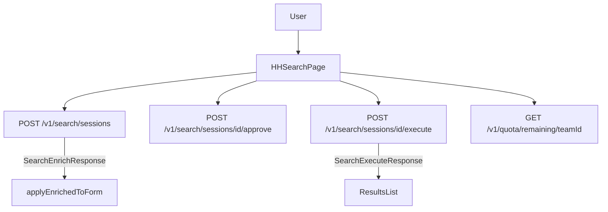

# Итоговый отчёт: аудит соответствия проекта и API-документации

Проведён аудит соответствия фронтенда спецификациям бэкенда (`openapi.json`) и HH API (`openapi hh.yml`), проверена структура запросов и выявлены возможности улучшения фильтрации.

---

## 1. Результаты аудита

### 1.1. Соответствие запросов контракту

- **Структура запросов** к бэкенду (SearchCreateRequest, SearchApproveRequest, SearchExecuteRequest, AdvancedSearchFiltersDTO) **совпадает** с OpenAPI и с типами в `src/types/index.ts`.
- Фронт отправляет `queryRaw` (camelCase), `team_id`, `hh_request` и остальные поля в соответствии со спецификацией.
- Все поля формы HH-поиска, которые должны попадать в `filters`, передаются через `buildFilters()` в `HHSearch.vue`, за исключением полей `lastUsedTimestamp` и `lastUsed` (см. раздел несоответствий).

### 1.2. Поток запросов HH-поиска

---

## 2. Перечень несоответствий

Подробности в [api-audit-mismatches.md](api-audit-mismatches.md).

| № | Описание | Критичность | Рекомендация |
|---|----------|-------------|--------------|
| 1 | Схема ответа POST /v1/search/sessions не описана в OpenAPI | Низкая | Описать в OpenAPI oneOf(SearchSessionResponse, SearchEnrichResponse) |
| 2 | Поля формы `lastUsedTimestamp` и `lastUsed` не попадают в запрос (в DTO и в buildFilters их нет) | Средняя | Добавить в AdvancedSearchFiltersDTO и в buildFilters при поддержке бэкенда |
| 3 | В ответе сессии поле `query_raw` может отсутствовать | Низкая | Бэкенд: всегда возвращать query_raw (хотя бы `{}`) |

Остальные проверенные эндпоинты по структуре запросов и ответов соответствуют типам и коду фронта.

---

## 3. Возможности улучшения фильтрации и интерфейса

Ниже — что уже предусмотрено в HH API или в бэкенде, но пока не в полной мере задействовано в интерфейсе.

### 3.1. Метки поиска резюме (labels)

- **HH API:** параметр `label` со значениями из справочника `resume_search_label`: `only_with_photo`, `only_with_salary`, `only_with_age`, `only_with_gender`.
- **Сейчас:** поле «Метки» реализовано как текстовый ввод (через запятую); пользователь может ошибиться в написании.
- **Улучшение:** добавить в `hhDictionaries.ts` константу `RESUME_SEARCH_LABEL` и вывести в форме мультиселект с подписями («Только с фотографией», «Только с зарплатой», «Только с возрастом», «Только с указанием пола»). Значения передавать в `labels` как сейчас.

### 3.2. Параметры «новые резюме» по автопоиску (last_used / last_used_timestamp)

- **HH API:** вместе с `saved_search_id` поддерживаются `last_used` и `last_used_timestamp` для поиска резюме, появившихся с момента последнего просмотра.
- **Сейчас:** в форме есть поля `lastUsedTimestamp` и `lastUsed`, но они не входят в AdvancedSearchFiltersDTO и не передаются в buildFilters().
- **Улучшение:** при поддержке бэкенда добавить эти поля в DTO и в buildFilters(); при наличии `savedSearchId` дать пользователю возможность заполнять время последнего просмотра (или подставлять его автоматически).

### 3.3. Подсказки по ключевым словам поиска

- **Бэкенд:** эндпоинты `/v1/static/suggest/resume-search-keyword` и `/v1/static/suggest/vacancy-search-keyword` (параметр `text`).
- **Сейчас:** в форме используются свободные поля промптов и текстовых условий без автодополнения по ключевым словам HH.
- **Улучшение:** подключить подсказки к полю текстового запроса (или к первому текстовому условию), чтобы сужать формулировки под словарь HH.

### 3.4. Сортировка вакансий по удалённости (distance)

- **HH API:** при поиске вакансий для `order_by=distance` требуются параметры `sort_point_lat` и `sort_point_lng`.
- **Сейчас:** в форме есть сортировка (`orderBy`), в т.ч. для вакансий; координаты точки для сортировки по расстоянию не запрашиваются.
- **Улучшение:** при выборе сортировки «по удалённости» для режима «Вакансии» добавить поля ввода широты/долготы (или выбор на карте) и передавать их в бэкенд, если контракт будет расширен (например, sort_point_lat / sort_point_lng в DTO для вакансий).

### 3.5. Справочник навыков (GET /v1/static/skills)

- **Сейчас:** в коде зафиксировано, что GET /v1/static/skills даёт 502; навыки подгружаются только через suggest.
- **Улучшение:** после устранения 502 на бэкенде использовать загрузку полного списка навыков для выпадающего списка/мультиселекта в дополнение к подсказкам.

### 3.6. Отображение полей ответа HH

- В карточках результатов показываются только часть полей (title/name, age, area, salary, alternate_url). В `hh_response_json` и в ответе execute приходят дополнительные поля (образование, опыт, контакты и т.д.).
- **Улучшение:** по необходимости расширить карточку результата (например, образование, краткий опыт, дата обновления резюме/вакансии) для лучшего UX без изменения контракта.

---

## 4. Приоритеты

| Приоритет | Что делать |
|-----------|------------|
| Высокий | Исправить передачу полей lastUsed/lastUsedTimestamp при поддержке бэкенда (корректность сценария «новые резюме по автопоиску»). |
| Средний | Добавить в UI метки поиска резюме (RESUME_SEARCH_LABEL) и описать ответ POST /v1/search/sessions в OpenAPI. |
| Низкий | Подключить подсказки по ключевым словам, сортировку по расстоянию для вакансий (при расширении контракта), доработку отображения полей результата. |

---

## 5. Связанные документы

- [api-catalog.md](api-catalog.md) — каталог эндпоинтов бэкенда и параметров HH.
- [api-frontend-map.md](api-frontend-map.md) — карта использования API на фронте (composables, страницы).
- [api-audit-mismatches.md](api-audit-mismatches.md) — детальный разбор несоответствий.
- [api-examples.md](api-examples.md) — примеры запросов и ответов.
- [hh-search-request.md](hh-search-request.md) — формат запроса поиска HH и пример payload.
